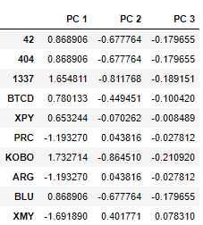
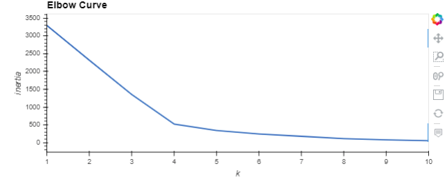
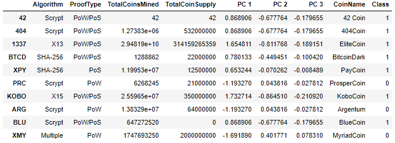
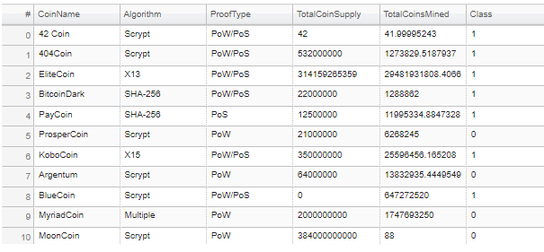
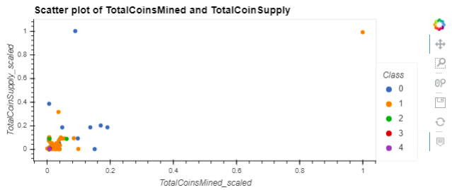

# Unit 13 - The Power of the Cloud and Unsupervised Learning

## <b> Clustering Crypto </b>


_[Cryptocurrencies coins by Worldspectrum](https://www.pexels.com/@worldspectrum?utm_content=attributionCopyText&utm_medium=referral&utm_source=pexels) | [Free License](https://www.pexels.com/photo-license/)_

### <b> Background </b>

One of my prominent client, an investment bank, is interested in offering a new cryptocurrencies investment portfolio for its customers, however, they are lost in the immense universe of cryptocurrencies. They have asked to help them make sense of it all by generating a report of what cryptocurrencies are available on the trading market and how they can be grouped using classification.

In this exercise I have applied concepts of unsupervised learning and the AWS SageMaker skills into action by clustering cryptocurrencies and creating plots to present my results.

### <b> Summary </b>

I have accomplished the following main tasks:

* **[Data Preprocessing](#Data-Preprocessing):** Prepared data for dimension reduction with PCA and clustering using K-Means.

* **[Reducing Data Dimensions Using PCA](#Reducing-Data-Dimensions-Using-PCA):** Reduced data dimension using the `PCA` algorithm from `sklearn`.

* **[Clustering Cryptocurrencies Using K-Means](#Clustering-Cryptocurrencies-Using-K-Means):** Predicted clusters using the cryptocurrencies data using the `KMeans` algorithm from `sklearn`.

* **[Visualizing Results](#Visualizing-Results):** Created some plots and data tables to present results.

* **[Challenge](#Optional-Challenge):** Deployed notebook to Amazon SageMaker.

### <b> Files locations in Github </b>

1. I have created a repository called `unit13-challenge` in the Github.

2. Inside the above there is a folder named "ClusteringCrypto" which has all the solution files

3. There is a Jupyter Notebook called [crypto_clustering.ipynb](ClusteringCrypto/Starter_Files/crypto_clustering.ipynb)

4. I have deployed the above model to AWS Sagemaker and notebook called [crypto_clustering_sm.ipynb](ClusteringCrypto/Starter_Files/crypto_clustering_sm.ipynb)

### <b> Details on each tasks </b>

#### Data-Preprocessing

First step of any model building is to get and process the data before applying any modelling techniques. Below is a stepwise process to achieve that:

1. Using the following `requests` library, retreived the necessary data from the following API endpoint from _CryptoCompare_ - `https://min-api.cryptocompare.com/data/all/coinlist`. Have used the 'Data' key from the json response, then transposed the DataFrame and called `crypto_df`.

Here is the sample of the initial transposed crypto dataframe 

   

With the data loaded into a Pandas DataFrame, performed the following data preprocessing tasks.

2. Kept only the necessary columns: 'CoinName','Algorithm','IsTrading','ProofType','TotalCoinsMined','TotalCoinSupply'
 
3. Kept only the cryptocurrencies that are trading.

4. Kept only the cryptocurrencies with a working algorithm.

5. Removed the `IsTrading` column.

6. Removed all cryptocurrencies with at least one null value.

7. Removed all cryptocurrencies that have no coins mined.

8. Droped all rows where there are 'N/A' text values.

9. Stored the names of all cryptocurrencies in a DataFrame named `coins_name`.

10. Removed the `CoinName` column.

11. Created dummy variables for all the text features, and stored the resulting data in a DataFrame named `X`.

12. Used the [`StandardScaler` from `sklearn`](https://scikit-learn.org/stable/modules/generated/sklearn.preprocessing.StandardScaler.html) to standardize all the data of the `X` DataFrame. This is important prior to using PCA and K-Means algorithms.

#### Reducing Data Dimensions Using PCA

1. Used the [`PCA` algorithm from `sklearn`](https://scikit-learn.org/stable/modules/generated/sklearn.decomposition.PCA.html) to reduce the dimensions of the `X` DataFrame down to three principal components.

2. Post reduction of the data dimensions, created a DataFrame named `pcs_df` using as columns names `"PC 1", "PC 2"` and `"PC 3"`;  used the `CoinName.index` as the index for this new DataFrame.

Sample of the DataFrame is 

   

#### Clustering Cryptocurrencies Using K-Means

Post the variable reduction using the principal component analysis, I have used the [`KMeans` algorithm from `sklearn`](https://scikit-learn.org/stable/modules/generated/sklearn.cluster.KMeans.html) to cluster the cryptocurrencies using the PCA data.

Performed the following tasks:

1. Created an Elbow Curve to find the best value for `k` using the `pcs_df` DataFrame.

   

2. From the Elbow Curve above, the best value for `k` is determined to be 4, ran the `Kmeans` algorithm to predict the `k` clusters for the cryptocurrencies data. Used the `pcs_df` to run the `KMeans` algorithm.

3. Created a new DataFrame named `clustered_df`, that includes the following columns `"Algorithm", "ProofType", "TotalCoinsMined", "TotalCoinSupply", "PC 1", "PC 2", "PC 3", "CoinName", "Class"`. You should maintain the index of the `cluster` DataFrame as is shown bellow.

   

#### Visualizing Results

In this section, you will create some data visualization to present the final results. Perform the following tasks:

1. Create a 3D-Scatter using Plotly Express to plot the clusters using the `clustered_df` DataFrame. Included the following parameters on the plot: `hover_name="CoinName"` and `hover_data=["Algorithm"]` to show this additional info on each data point.

2. Used `hvplot.table` to create a data table with all the current tradable cryptocurrencies. The table should have the following columns: `"CoinName", "Algorithm", "ProofType", "TotalCoinSupply", "TotalCoinsMined", "Class"`

   

3. Created a scatter plot using `hvplot.scatter`, to present the clustered data about cryptocurrencies having `x="TotalCoinsMined"` and `y="TotalCoinSupply"` to contrast the number of available coins versus the total number of mined coins. Use the `hover_cols=["CoinName"]` parameter to include the cryptocurrency name on each data point.

   

### Optional Challenge

I have uploaded CryptoCluster Jupyter notebook to Amazon SageMaker and deployed it.

The `hvplot` and Plotly Express libraries are not included in the built-in anaconda environments, so I have used the `altair` library instead.

I have performed the following tasks:

1. Uploaded Jupyter notebook and renamed it as `crypto_clustering_sm.ipynb`

2. Selected the `conda_python3` environment.

3. Imported the `altair` library by running the following code before the initial imports.

  ```python
  !pip install -U altair
  ```

4. Used the `altair` scatter plot to create the Elbow Curve.

5. Used the `altair` scatter plot, instead of the 3D-Scatter from Plotly Express, to visualize the clusters. Since this is a 2D-Scatter, use `x="PC 1"` and `y="PC 2"` for the axes, and add the following columns as tool tips: `"CoinName", "Algorithm", "TotalCoinsMined", "TotalCoinSupply"`.

6. Used the `altair` scatter plot to visualize the tradable cryptocurrencies using  `x="TotalCoinsMined"` and `y="TotalCoinSupply"` for the axes.

7. Showed the table of current tradable cryptocurrencies using the `display()` command.

8. Removed all `hvplot` and Plotly Express references from your code.

#### Complementary Resources

* [Altair visualization library website](https://altair-viz.github.io/).

* [Simple line chart using Altair](https://altair-viz.github.io/gallery/simple_line_chart.html).

* [Simple Scatter Plot with Tooltips using Altair](https://altair-viz.github.io/gallery/scatter_tooltips.html)

* [Color customization on Altair](https://github.com/altair-viz/altair/issues/921#issuecomment-395416682)

* [Printing all rows from a DataFrame](https://stackoverflow.com/a/30691921/4325668)

* [Install External Libraries and Kernels in Amazon SageMaker Notebook Instances](https://docs.aws.amazon.com/sagemaker/latest/dg/nbi-add-external.html)
